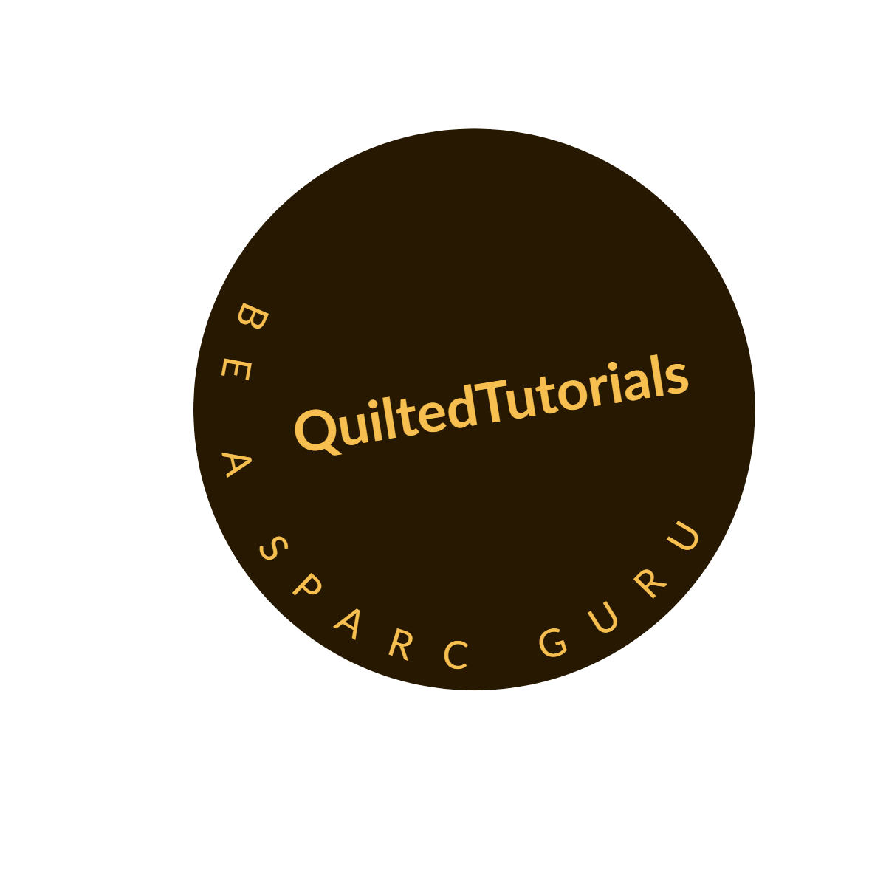

# **
SPARC FAIR Codeathon 2022
**

# 
Quilted Tutorials: realising the potential of tools within the **SPARC** ecosystem

#### Please visit our [**website**](https://quilted-tutorial.github.io/SPARC-guru/) where you will find a collection of tutorials to begin your journey towards becoming a **SPARC** Guru. If you want to get started straight away, head to the [**Getting started**](#Getting-started) section.

## **Table of Content**
 1. [**About**](#About)
 2. [**Quilted Tutorials**](#Quilted-Tutorials)
 3. [**Dependencies**](#Dependencies)
 4. [**Getting started**](#Getting-started)
 5. [**License**](#License)
 6. [**Team**](#Team)
 7. [**Acknowledgments**](#Acknowledgments)
 
### **About**
The **S**timulating **P**eripheral **A**ctivity to **R**elieve **C**onditions ([**SPARC**](https://sparc.science/about)) program is supported by the NIH Common Fund to provide a scientific and technological foundation for future bioelectronic medicine devices and protocols. The initiative is made up of over ***60*** research teams scattered around the globe, all working together on a common objective. The entire project is **Open Source** and follows the **F**indable, **A**ccessible, **I**nteroperable, and **R**eusable ([**FAIR**](https://www.nature.com/articles/sdata201618)) guidelines for data management.

In 2021, the amazing team of the **D**ata and **R**esource **C**enter ([**DRC**](https://pubmed.ncbi.nlm.nih.gov/34248680/)) organised a [**Codeathon**](https://sparc.science/help/2021-sparc-fair-codeathon) to improve various elements of the **SPARC** program. This year, they've done it [again](https://sparc.science/help/2022-sparc-fair-codeathon)! 

In our project, we have designed an online hub and populated it with tutorials to showcase how tools within the **SPARC** ecosystem can be combined to achieve unified workflows. Each tutorial is contained within an individual Jupyter notebook.

### **Quilted Tutorials**
#### **Tutorial 1: Mapping 2D data points to a 3D organ scaffhold**
The first Quilted Tutorial is designed to guide users on how to project 2D spatial data sets onto a 3D organ scaffold using tools within the [**SPARC**](https://sparc.science/) ecosystem. The objective for this tutorial is to project the spatial locations of 3 different types of neurites on the surface of the rat stomach onto a 3D scaffold of the organ. The experimental data and 3D scaffold are downloaded from the **SPARC** portal and **SPARC** Scaffold Mapping Tools, respectively. Below is a figure of the workflow for the tutorial: the experimental data is acquired using Pennsieve and piped into a Jupyter Notebook where the 2D data is mapped to the 3D organ scaffold and visualised.

#### **Tutorial 2: Re-sampling data for computational simulations**
The second Quilted Tutorial is designed to guide the users on how to modify data points for other applications. The objective of this tutorial is to resample some 2D data points for future simulations. Below is a figure of the workflow for the tutorial: the experimental data is acquired using Pennsieve and piped into a Jupyter Notebook where the 2D data is processed before being visualised.

### **Dependencies**
The tutorial has been tested using Ubuntu 22.04 LTS and Python 3.10.4

Here is the list of all the dependencies that are needed to run this tutorial. They are all listed in the requirements.txt file as well

   * pandas, version 1.4.3
   * openpyxl, version 3.0.10
   * numpy, version 1.23.0
   * numpy-stl, version 2.17.1
   * matplotlib, version 3.5.2
   * ipympl, version 0.9.1
   * jupyterlab, version 3.4.4
   * ipywidgets, version 7.7.1
   * tqdm, version 4.64.0

### **Getting started**
Start by cloning the GitHub repository onto your local machine into the _SPARC-tutorial_ folder with the following command:

    $ git clone git@github.com:SPARC-FAIR-Codeathon/SPARC-Tutorial.git SPARC-tutorial

The tutorial is contained in a Jupyter Notebook and requires JupyterLab to run. 
#### **If you are familiar with JupyterLab**
Open JupyterLab and navigate to the _SPARC-tutorial_ folder. Open the SPARC-tutorial.ipynb file and follow the tutorial.

#### **If you are not familiar with JupyterLab**
Not sure if JupyterLab is installed on your machine? No worries, we've got you covered! Check out if it is installed on your machine using this command in a terminal:

    $ which jupyter-lab
    
If there is no output, [install](https://jupyter.org/install) JupyterLab with the following command:
    
    $ pip install jupyterlab
    
Once this is done or if you already have JupyterLab installed on your machine simply navigate into the cloned directory and run JupyterLab:

    $ cd SPARC-tutorial && jupyter-lab --LabApp.token=''

From your browser, you can try out a tutorial by navigating to the folder and opening the notebook by clicking on ***SPARC-tutorial.ipynb*** and follow the tutorial from there. 
    
### **License**
This tutorial is available under the MIT License, thereby making it fully accessible to anyone.

### **Team**

   * [Yuda Munarko](https://github.com/napakalas) (Team leader)
   * [Omkar Athavale](https://github.com/OmkarAthavale) (Tutorial developer)
   * [Mathias Roesler](https://github.com/mathiasroesler) (Writer and Web developer)
   * [Niloofar Shahidi](https://github.com/Niloofar-Sh) (Writer)
   * [Kenneth Tran](https://github.com/ktra014) (Writer and Tutorial developer)

### **Acknowledgments**
We would like to thank the organizers of the 2022 **SPARC FAIR** Codeathon as well as the **SPARC DRC** teams for their guidance and help during this Codeathon. Find out more about them in the About section!
